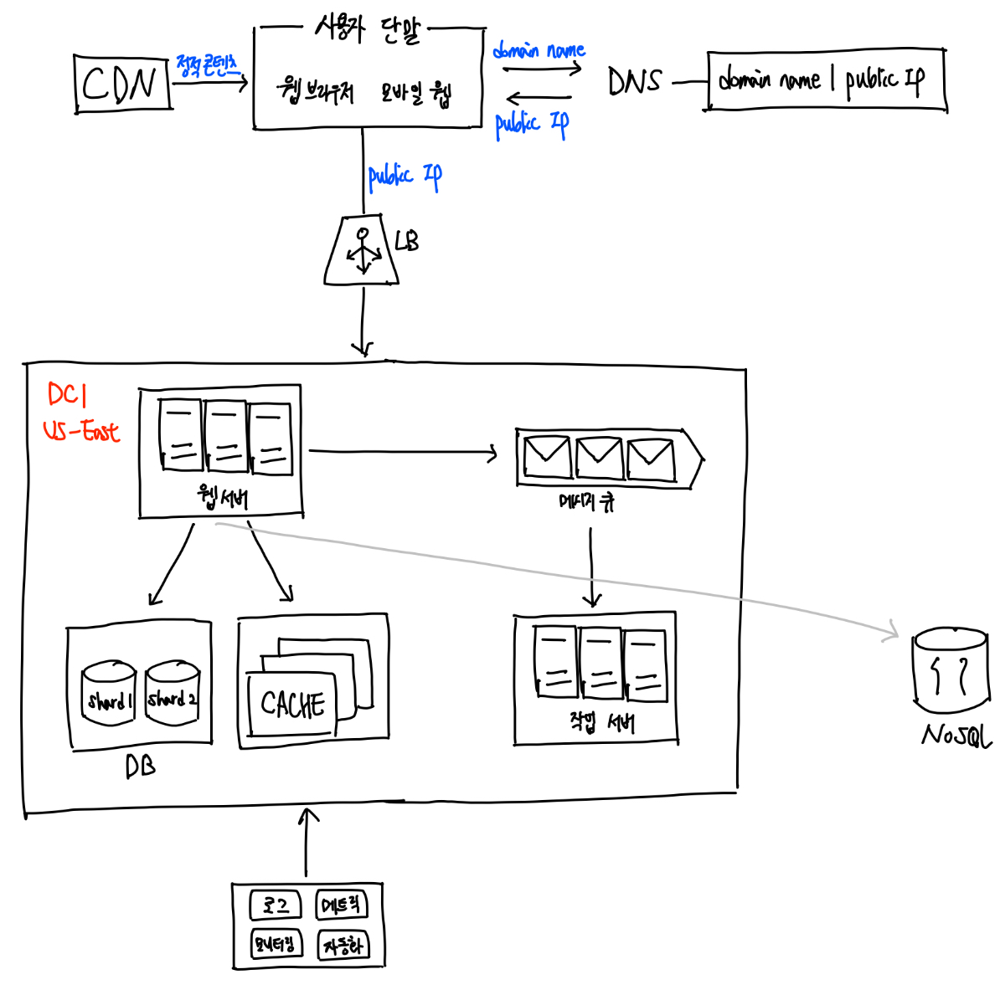

# System Design

## User based Scalability 

시스템 규모 확장을 위한 기법들 
- 웹 계층은 무상태 계층으로 
- 모든 계층에 다중화 도입 
- 가능한 한 많은 데이터를 캐시 
- 여러 데이터 센터를 지원할 것 
- 정적 콘텐츠는 CDN을 통해 서비스할 것 
- 데이터 계층은 샤딩을 통해 그 규모를 확장할 것 
- 각 계층은 독립적 서비스로 분할할 것 
- 시스템을 지속적으로 모니터링하고, 자동화 도구들을 활용할 것 

# Rough Size Estimation 

- 근사치를 활용한 계산 (rounding and approximation) : 면접장에서 복잡한 계산을 하는 것은 어려운 일, 적절한 근사치를 활용하여 시간을 절약  
  - ex. 99987/9.1은 100,000/10으로 간소화 
- 가정(assumption)들은 나중에 살펴볼 수 있도록 적어두자 
- 단위(unit) 붙이기
- 많이 출제되는 개략적 규모 추정 문제 : QPS, 최대 QPS, 저장소 요구량, 캐시 요구량, 서버 수 등을 추정 

> 가상 면접 사례로 배우는 대규모 시스템 설계 기초 1, 2를 참고하였습니다.
