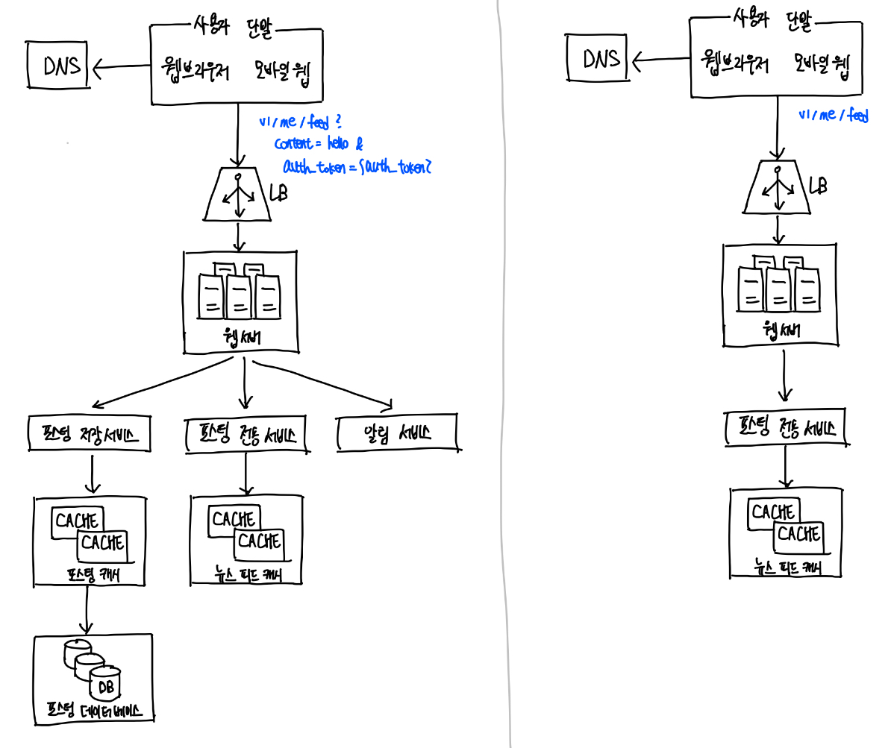
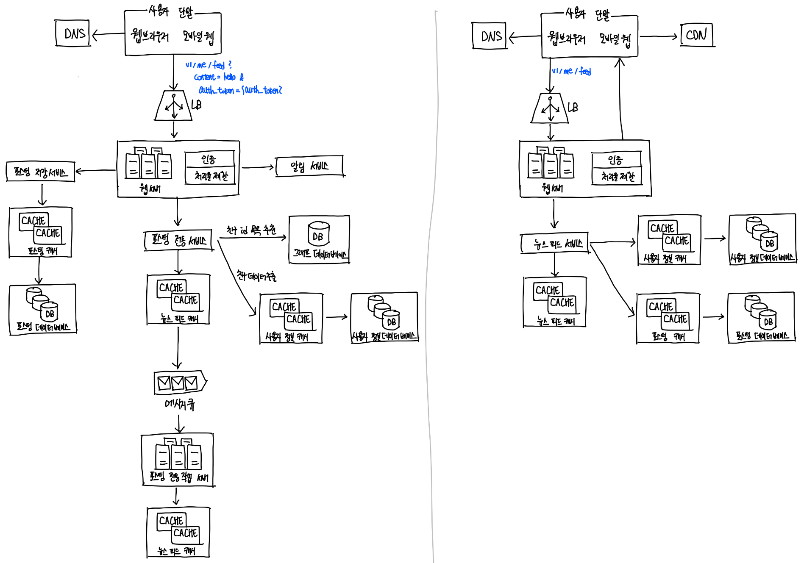

# System Design Four Step Approach 

## Step 1 : 문제 이해 및 설계 범위 확정 (3~10분)

요구 사항을 완전히 이해하지 않고 답을 내놓는 행위는 아주 엄청난 부정적 신호 
- 깊이 생각하고 질문하여 요구사항과 가정들을 분명히 하기 
- 엔지니어가 가져야 할 가장 중요한 기술 중 하나는 올바른 질문을 하는 것, 적절한 가정을 하는 것, 시스템 구축에 필요한 정보를 모으는 것 

### 어떤 질문을 해야 할까?

요구 사항을 이해하는 데 필요한 질문하기 

- 구체적으로 어떤 기능들을 만들어야 하는지
- 제품 사용자 수는 얼마나 되는지
- 회사의 규모는 얼마나 빨리 커지리라 예상하는지
  - 석 달, 여섯 달, 일년 뒤의 규모는 얼마나 되리라 예상하는지 
- 회사가 주로 사용하는 기술 스택은 무엇인지 
  - 설계를 단순화하기 위해 활용할 수 있는 기존 서비스로는 어떤 것들이 있는지 

### 예시. 뉴스피드 시스템 설계하기  

step1을 적용해보자 

Q. 모바일 앱과 웹 앱 가운데 어느 쪽을 지원해야 하는지, 아니면 둘 다 지원해야 하는지 \
A. 둘 다 지원 

Q. 가장 중요한 기능 \
A. 새로운 포스트를 올리고, 다른 친구의 뉴스 피드를 볼 수 있도록 하는 기능 

Q. 뉴스 피드는 시간 역순으로 정렬하는지, 아니면 다른 특별한 정렬 기준이 있는지
- 특별한 정렬 기준을 묻는 이유는 피드에 올라갈 포스트마다 다른 가중치가 부여되여야 하는지 알고 싶어서임. 가령 가까운 친구의 포스트가 사용자 그룹에 올라가는 포스트보다 더 중요하다거나

A. 문제를 단순하게 만들기 위해 일단 시간 역순으로 정렬된다 가정 

Q. 한 사용자는 최대 몇 명의 사용자와 친구를 맺을 수 있는지\
A. 5000명 

Q. 사이트로 오가는 트래픽 규모 \
A. 일간 능동 사용자는 천만 명 

Q. 피드에 이미지나 비디오도 올라갈 수 있는지, 아니면 포스트는 그저 텍스트인지 \
A.이미지나 비디오 같은 미디어 파일도 포스트 할 수 있어야 함 

## Step 2 : 개략적인 설계안 제시 및 동의 구하기 (10~15분)

개략적인 설계안을 제시하고 동의를 구하는 과정 (협력하며 진행하는 것이 좋다.)

- 설계안에 대한 최초 청사진을 제시하고 의견 구하기 
- 화이트보드나 종이에 핵심 컴포넌트를 포함하는 다이어그램을 그리기 
  - 클라이언트(모바일/웹), API, 웹 서버, 데이터 저장소, 캐시, CDN, 메시지 큐 같은 것들 포함 
- 최초 설계안이 시스템 규모에 관계된 제약 사항들을 만족하는지를 개략적으로 계산해보기 

### 예제. 뉴스피드 시스템 설계하기

개략적으로 보면 시스템은 2가지 flow로 나누어 생각해 볼 수 있다. 
- 피드 발행(feed publishing), 피드 생성(feed building)

- 피드 발행 : 사용자가 포스트를 올리면 관련된 데이터가 캐시/데이터베이스에 기록, 해당 사용자의 친구 뉴스 피드에 뜨게 된다. 
- 피드 생성 : 어떤 사용자의 뉴스 피드는 해당 사용자 친구들의 포스트를 시간 역순(최신부터 오래된 순) 정렬 

## Step 3 : 상세 설계 (10~25분)

이 단계에 왔으면 다음의 작업들은 완료가 된 상태이다. 

- 시스템에서 전반적으로 달성해야 할 목표와 기능 범위 확인 
- 전체 설계의 개략적인 청사진 마련 
- 해당 청사진에 대한 면접관의 의견 청취 
- 상세 설계에서 집중해야 할 영역들 확인 

이제, 설계 대상 텀포넌트 사이의 우선순위를 정하는 것이다. 
- 대부분의 면접관은 특정 시스템 컴포넌트들의 세부 사항을 깊이 있게 설명하는 것을 원한다. 
 - ex. URL 단축 생성기 설계 : 해시 함수의 설계를 구체적을 설명, 채팅 시스템 : 지연시간을 줄이고 사용자의 온/오프라인 상태 표시 방법 

### 예시. 뉴스피드 시스템 설계하기 

뉴스피드 시스템의 개략적인 설계를 마쳤다고 가정 

다음의 2가지 중요한 용례를 깊이 있게 탐구해야 함 
1. 피드 발행 
2. 뉴스 피드 가져오기 

 
## Step 4 : 마무리 (3~5분)

- 만약, 시스템 병목 구간, 혹은 좀 더 개선 가능한 지점을 찾아내라고 한다면 설계가 완벽하다는 대답은 안됨 
  - 개선할 점은 언제나 있기 마련이다. 
- 설계를 다시 한번 요약해주기 
- 오류가 발생하면 무슨일이 생기는지(서버 오류, 네트워크 장애 등) 따져보기 
- 운영 이슈도 논의해보기 (메트릭 수집 방법, 로그, 시스템 배포 방식)
- 미래의 규모 확장 요구 대처 
- 필요하지만 다루지 못했던 세부적 개선 사항들을 제안 
