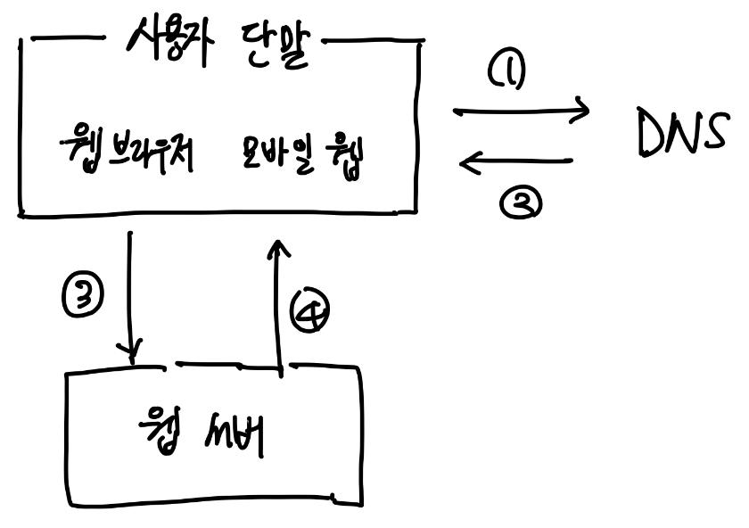
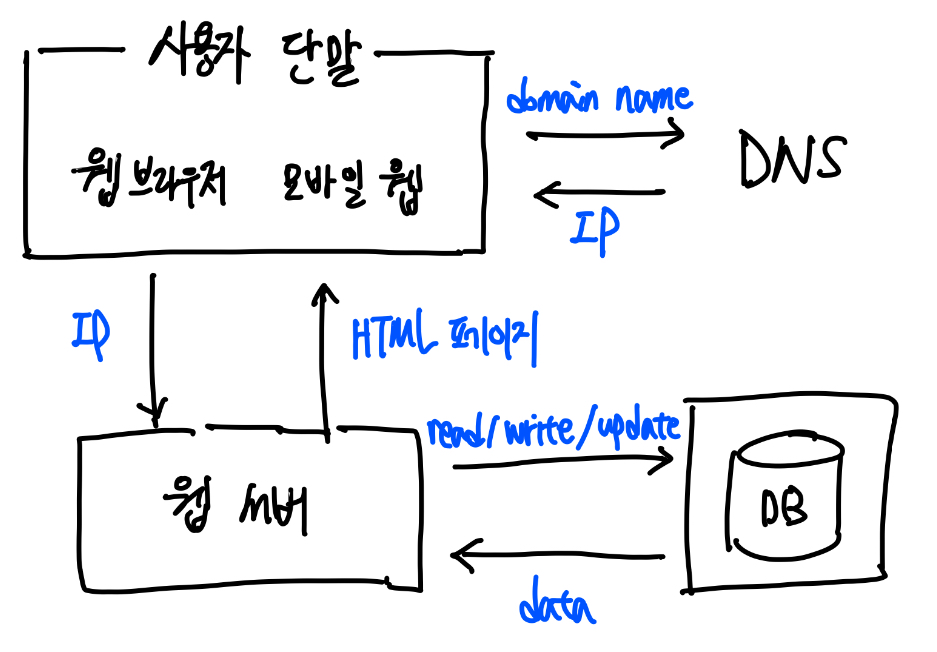
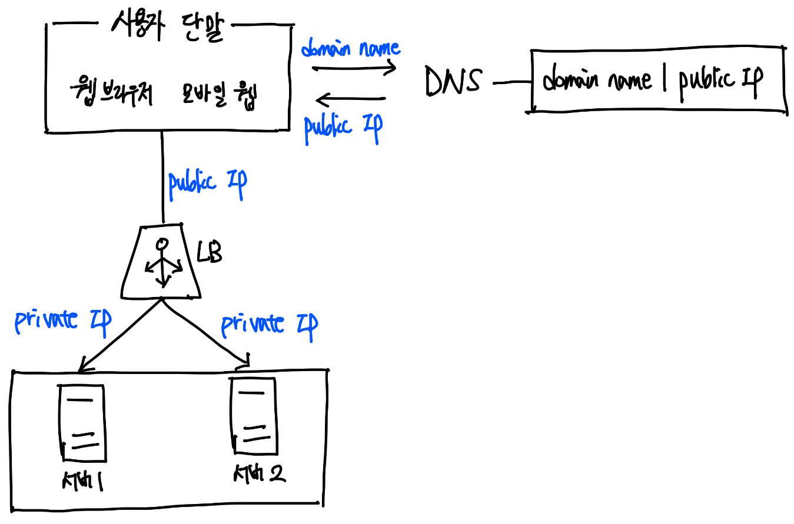
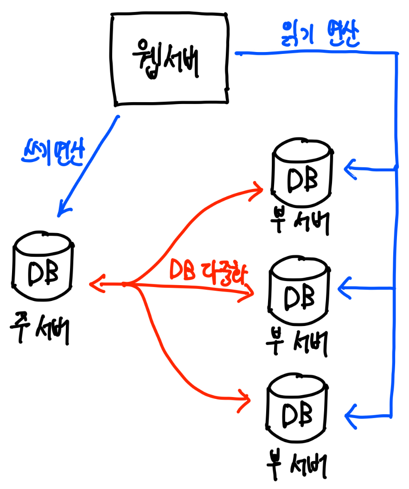
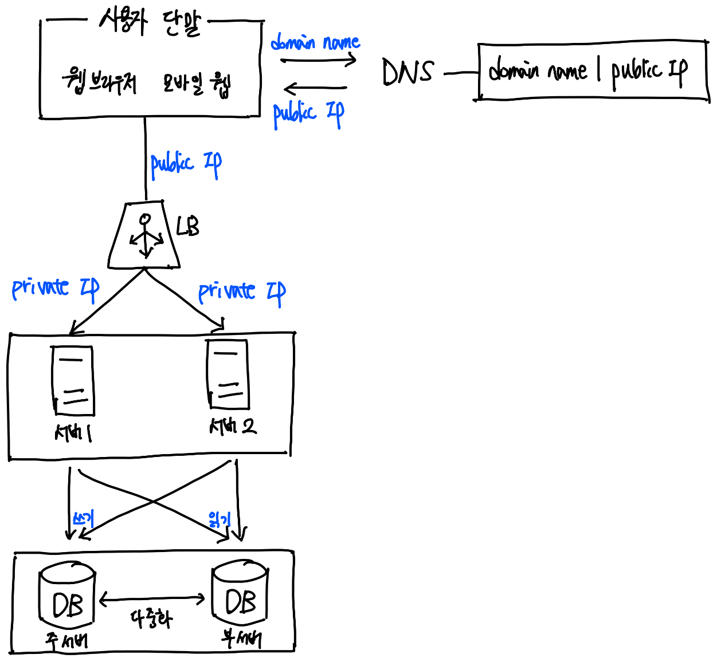
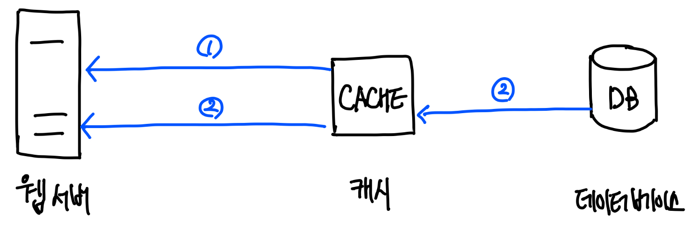
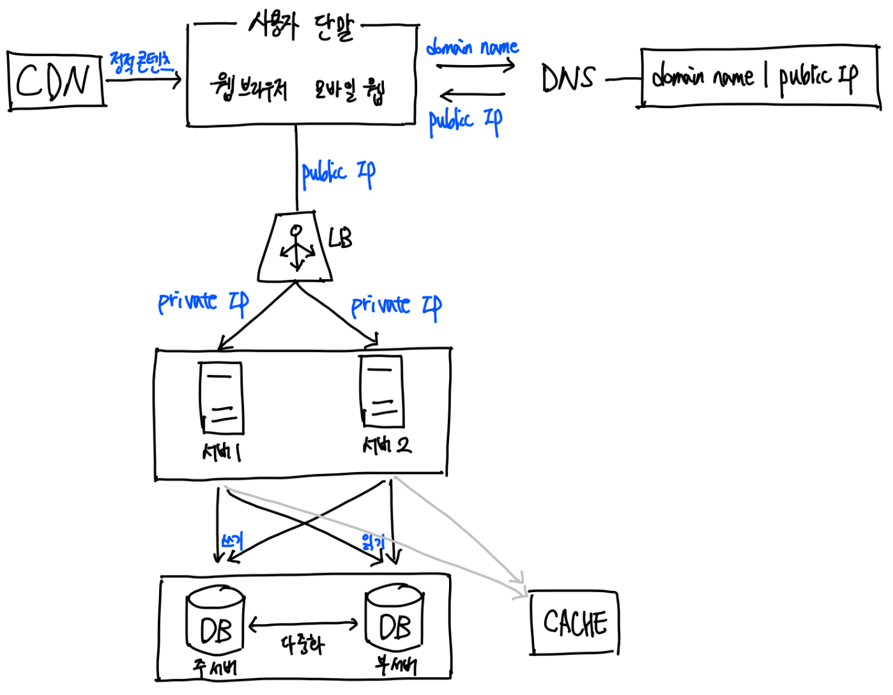
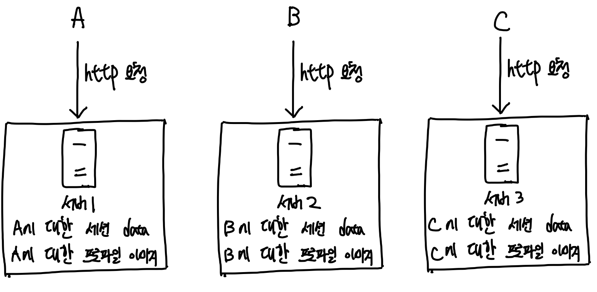
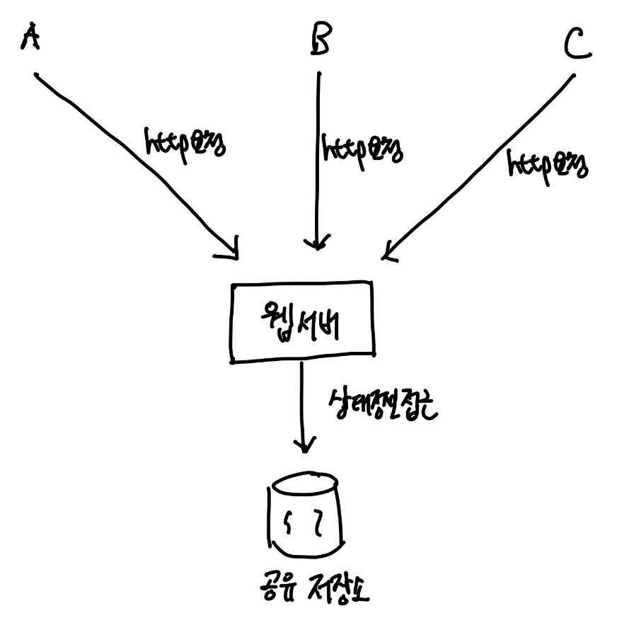
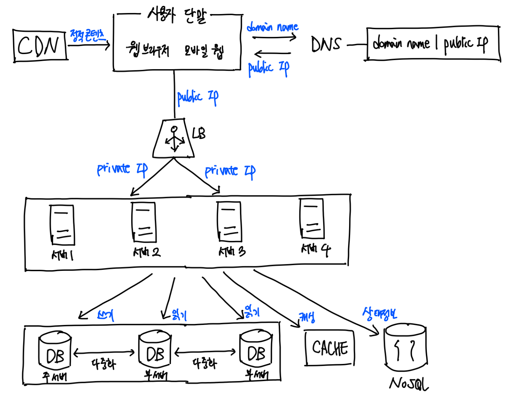

# User Based Scalability 

단일 서버부터 시작해서 사용자 수에 따른 규모 확장성에 대해 알아보자 

## Single Server 

웹, 앱, 데이터베이스, 캐시 등이 전부 서버 한 대에서 실행되는 경우를 생각해보자 

1. 사용자는 도메인 이름(ex.www.example.com)을 이용해서 웹 사이트에 접속한다. 이때 DNS에 질의하여 IP 주소로 변환하는 과정이 필요하다. 
2. DNS 조회 결과로 IP 반환된다. (이 주소는 웹 서버의 주소) 
3. 해당 IP 주소로 HTTP 요청이 전달된다. 
4. 요청을 받은 웹 서버는 HTML 페이지나 JSON 형태의 응답을 반환한다. 

> DNS는 보통 제3 사업자가 제공하는 유료 서비스 이용(시스템의 일부가 아님)

## Database 

사용자 수가 늘면 서버 하나로는 충분하지 않아 여러 서버를 두어야 한다.
- 하나는 웹/모바일 트래픽 처리 용도 (웹/모바일 트래픽 처리 서버 - 웹 계층)
- 다른 하나는 데이터베이스 용도 (데이터베이스 서버 - 데이터 계층)

> 웹/모바일 트래픽 서버와 데이터베이스 서버를 분리하면 각각을 독립적으로 확장해 나갈 수 있다. 

### 어떤 Database를 사용할 것인가? 

전동적인 관계형 데이터베이스와 비-관계형 데이터베이스 사이에서 고를 수 있다. 

#### 관계형 데이터베이스 

관계형 데이터베이스는 관계형 데이터베이스 관리 시스템(RDBMS)이라고도 부른다. RDBMS 가운데 가장 유명한 것은 MySQL, Oracle, PostgreSQL 등이 있다. 

- 관계형 데이터베이스는 자료를 row, column으로 표현한다. SQL을 사용하면 여러 데이블에 있는 데이터를 그 관계에 따라 JOIN하여 합칠 수 있다. 

#### 비-관계형 데이터베이스 

비-관계형 데이터베이스는 NoSQL이라고도 부른다. 대표적인 것으로는 HBase, Amazon DynamoDB 등이 있다. 

- NoSQL은 4부류로 나눌 수 있는데, 키-값 저장소, 그래프 저장소, 칼럼 저장소, 문서 저장소이다. 
- 비-관계형 데이터베이스는 일반적으로 조인 연산은 지원하지 않는다.

> 비-관계형 데이터베이스가 적합한 경우 
> - 아주 낮은 응답 지연시간(latency)이 요구되는 경우
> - 다루는 데이터가 비정형(unstructured)이라 관계형 데이터가 아닌 경우
> - 데이터(JSON, YAML, XML 등)를 직렬화하거나(serialize) 역직렬화(deserialize)할 수 있기만 하면 되는 경우
> - 아주 많은 양의 데이터를 저장할 필요가 있는 경우 

## 수직적 규모 확장 vs 수평적 규모 확장 

- **수직적 규모 확장** : scale up, 서버에 고사양 자원(CPU, RAM 등)을 추가 
  - 서버로 유입되는 트래픽 양이 적을 때 좋은 선택 
  - 가장 큰 장점이 단순함
  - 심각한 단점은 확장에 한계가 있으며, 장애에 대한 자동복구(failover)나 다중화(redundancy) 방안을 제시하지 않음 
    - 따라서, **서버에 장애가 발생하면 웹사이트/앱이 완전히 중단** 
- **수평적 규모 확장** : scale out, 더 많은 서버를 추가하여 성능을 개선 
  - **대규모 애플리케이션을 지원**하는 데는 수평적 규모 확장법이 적절 
  - 너무 많은 사용자가 접속하여 웹 서버가 한계 상황에 도달하게 되면 응답 속도가 너무 느려지거나 서버 접속이 불가능해질 수 있다. 
    - 이때, **부하 분산기 또는 로드밸런서를 도입**하는 것이 최선 

## Load Balancer 

로드 밸런서는 부하 분산 집합에 속한 웹 서버들에게 트래픽 부하를 고르게 분산하는 역할을 한다.

- 그림의 **Public IP는 로드 밸런서의 Public IP 주소**이다. 
  - 따라서 웹 서버는 Client의 접속을 직접 처리하지 않는다. 
  - 더 나은 보안을 위해 **서버 간 통신에는 Private IP 주소가 이용**된다. 
  - **로드 밸런서는 웹 서버와 통신하기 위해 Private IP 주소 이용** 
- 그림과 같이 부하 분산 집합에 서버를 추가하면 장애를 자동복구하지 못하는 문제(no failover)가 해소되며, 웹 계층의 가용성(availability)가 향상된다. 
  - 서버 1이 다운되면(offline) 모든 트래픽은 서버 2로 전송 (웹 사이트 전체가 다운되는 일 방지)
    - 부하를 나누기 위해 서버를 추가하는 경우도 있음 
  - 만약 웹 사이트로 유입되는 트래픽이 가파르게 증가하면 2대의 서버로 트래픽을 감당할 수 없는 시점이 오게 된다.
    - 이때 웹 서버 계층에 서버를 추가하기만 하면, 로드 밸런서가 자동적으로 트래픽 분산한다. 

> Private IP 주소는 같은 네트워크에 속한 서버 사이의 통신에만 쓰일 수 있는 IP 주소, 인터넷을 통해서는 접속할 수 없음 

이제 하나뿐인 데이터베이스 서버의 장애 자동 복구와 다중화를 지원할 수 있도록 구성해 보자

## 데이터베이스 다중화 

데이터베이스 다중화는 보통 **주(master)-부(slave) 관계를 설정**하고 **데이터 원본은 주 서버**에, **사본은 부 서버에 저장**하는 방식이다. 

- 쓰기 연산은 마스터에서만 지원 
  - insert, update, delete 등 데이터베이스를 변경하는 명령어들을 마스터로만 전달되어야 한다. 
- 부 데이터베이스는 주 데이터베이스로부터 그 사본을 전달받으며, 읽기 연산만을 지원 

> 대부분의 애플리케이션은 **읽기 연산의 비중**이 쓰기 연산보다 훨씬 **높다.** 
> - 부 데이터베이스의 수 >= 주 데이터베이스 수 

### 데이터베이스 다중화의 장점 

- 더 나은 성능 : 모든 데이터 변경 연산 - 주 데이터베이스 / 읽기 연산 - 부 데이터베이스, 병렬로 처리될 수 있는 질의(query) 수가 늘어나 성능 향상 
- 안정성(reliability) : 데이터베이스 서버 일부가 파괴되어도 데이터 보존 가능(데이터를 지역적으로 떨어진 여러 장소에 다중화시켜 놓을 수 있기 때문)
- 가용성(availability) : 데이터를 여러 지역에 복제해 둠으로써, 하나의 데이터베이스 서버에 장애가 발생해도 다른 서버에 있는 데이터를 가져와 계속 서비스 가능 

#### 만약 데이터베이스 서버 중 하나가 다운되면? 

1. 부 서버가 한 대 뿐인데, 다운된 경우 : 읽기 연산이 한시적으로 모두 주 데이터베이스로 전달, 즉시 새로운 부 데이터베이스 서버가 장애 서버를 대체
2. 부 서버가 여러 대인 경우 : 읽기 연산이 나머지 부 데이터베이스 서버로 분산, 새로운 부 데이터베이스 서버가 장애 서버를 대체 
3. 주 서버가 다운된 경우 : 한 대의 부 데이터베이스 서버만 있는 경우 **해당 부 데이터베이스가 새로운 주 서버**가 되며, 모든 데이터베이스 연산은 일시적으로 새로운 주 서버에서 수행, 그리고 **새로운 부 서버가 추가**

> 만약 부 서버에 보관된 데이터가 최신 상태가 아니라면? 
> 
> 없는 데이터는 복구 스크립트를 돌려서 추가해야 한다. 
> 다중 마스터나 원형 다중화 방법도 있다. 하지만 훨씬 복잡하다. 

#### DB 다중화를 고려한 설계 

- 동작 과정 
  - 사용자는 DNS로부터 LB의 Public IP 받기 
  - 사용자는 해당 Public IP를 사용해 LB에 접속 
  - HTTP 요청은 서버 1이나 서버 2로 전달 
  - 웹 서버는 사용자 데이터를 부 서버에서 읽기 
  - 웹 서버는 데이터 변경 연산을 주 서버로 전달

이제 응답시간(latency)를 개선해보자 

## 캐시 

캐시는 값비싼 연산 결과 또는 자주 참조되는 데이터를 메모리 안에 두고, 뒤이은 요청이 보다 빨리 처리될 수 있도록 하는 저장소 

> 애플리케이션의 성능은 데이터베이스를 얼마나 자주 호출하느냐에 크게 좌우되는데, 캐시는 그런 문제를 완화할 수 있다. 

### 캐시 계층 

**캐시 계층(cache tier)는 데이터가 잠시 보관되는 곳**으로 데이터베이스보다 훨씬 빠르다. 
- 별도의 캐시 계층을 두면 성능이 개선될 뿐 아니라 데이터베이스의 부하를 줄일 수 있고, 캐시 계층의 규모를 독립적으로 확장 가능하다. 
- 캐시 서버를 이용하는 방법은 간단하다. 대부분의 캐시 서버들이 일반적으로 널리 쓰이는 프로그래밍 언어로 API를 제공하기 때문이다. 

#### 읽기 주도형 캐시 전략(read-through caching strategy) 

요청을 받은 웹 서버는 캐시에 응답이 저장되어 있는지를 본다. 

1. 데이터가 캐시에 있는 경우 : 캐시에서 데이터를 읽는다. 
2. 데이터가 캐시에 없는 경우 : 데이터베이스에서 해당 데이터를 읽어 캐시에 쓴다. 그리고 웹 서버에 데이터를 반환한다. 

이러한 캐시 전략을 읽기 주도형 캐시 전략이라고 한다. 

> 캐시 전략은 다양하게 있다. 캐시할 데이터 종류, 크기, 액세스 패턴에 맞는 캐시 전략을 선택하면 된다. 

### 캐시 사용 시 유의점 

- **캐시가 적절한 상황 : 데이터 갱신이 자주 안 일어나지만, 참조가 빈번하게 일어날 때** 
- 캐시에 두어야 하는 데이터 : **캐시는 데이터를 휘발성 메모리**에 둔다. 따라서 영속적으로 보관할 데이터를 캐시에 두는 것은 바람직하지 않다. 
  - 캐시 서버 재시작되면 캐시 내의 모든 데이터는 사라진다. 중요한 데이터는 persistent data store에 두자. 
- 캐시에 보관된 데이터의 만료 : 데이터 만료에 대한 정책을 두는 것이 좋은 습관이다. 만료된 데이터는 캐시에서 삭제되어야 한다. 
  - 만료 정책이 없으면 캐시에 계속 남는다. 
  - **만료 기한이 짧으면 빈번하게 데이터베이스를 읽는다.** 
  - **만료 기한이 길면 원본과 차이가 날 가능성이 높다.** 
- **캐시의 데이터 일관성 유지** : 일관성은 데이터 저장소의 원본과 캐시 내의 사본이 같은지 여부 
  - 저장소의 원본을 갱신하는 연산과 캐시를 갱신하는 연산이 단일 트랜잭션으로 처리되지 않는 경우는 일관성이 깨질 수 있다. 
  - 여러 지역에 걸쳐 시스템을 확장해 나가는 경우 캐시와 저장소 사이의 일관성을 유지하는 것은 어려운 문제가 된다. 
- **캐시의 장애 대처 방법** : 캐시 서버를 한 대만 두는 경우 해당 서버는 단일 장애 지점이 되어버릴 가능성이 있다. 따라서 여러 지역에 거쳐 캐시 서버를 분산해야 한다. 
- 캐시 메모리의 크기 : 캐시 메모리가 너무 작으면 액세스 패턴에 따라 데이터가 너무 자주 캐시에서 밀려나버려 캐시의 성능 저하가 일어난다. 
  - 캐시 메모리를 과할당(overprovision)하면 해결되는데, 캐시에 보관할 데이터가 갑자기 늘어났을 때 생길 문제도 방지가 필요하다. 
- **캐시 데이터 방출 정책** : 캐시가 꽉 찼을 때 추가로 캐시에 데이터를 넣어야 하는 경우 기존 데이터를 내보내야 한다. 이것을 캐시 데이터 방출 정책이라고 한다. 
  - **가장 널리쓰이는 것은 LRU**(Least Recently Used - 가장 오래된 데이터 내보내기)
  - 다른 정책으로는 LFU(Least Frequently Used - 사용된 빈도가 가장 낮은 데이터를 내보내는 정책), FIFO(First In First Out - 가장 먼저 들어온 데이터 내보냄) 

> 단일 장애 지점(Single Point of Failure)은 어떤 특정 지점에서의 장애가 전체 시스템의 동작을 중단시켜버릴 수 있는 경우를 말한다. 

## CDN 

CDN은 정적 콘텐츠를 전송하는 데 쓰이는, 지리적으로 분산된 서버의 네트워크이다. 
- 이미지, 비디오, CSS, JavaScript 파일 등을 캐시할 수 있다. 

> 동적 콘텐츠 캐싱은 요청 경로(request path), 질의 문자열(query string), 쿠키(cookie), 요청 헤더(request header) 등의 정보를 기반하여 HTML 페이지를 캐시하는 것 

### CDN 어떻게 동작하는가? 

간단하게 설명하면 다음과 같다. 

1. 사용자가 웹사이트 방문 
2. 해당 사용자에게 가장 가까운 CDN 서버가 정적 콘텐츠를 전달

> 사용자가 CDN 서버로부터 멀면 멀수록 웹사이트는 천천히 로드 

좀 더 자세히 동작을 살펴보자

1. 사용자가 이미지 URL을 통해 image 파일에 접근
   - 이때, 이미지 URL은 CDN 서비스 사업자가 제공한 것 
2. CDN 서버의 캐시에 해당 이미지가 없는 경우, 서버는 원본(origin)서버에 요청하여 파일 가져오기 
   - 원본 서버는 웹 서버일 수도 있고, S3같은 온라인 저장소일 수도 있다. 
3. 원본 서버가 파일을 CDN 서버에 반환
   - 응답의 HTTP 헤더에는 해당 파일이 얼마나 오래 캐시될 수 있는지를 알 수 있는 TTL(Time-To-Live)값이 있다. 
4. CDN 서버는 파일을 캐시하고 사용자에게 반환, 이미지는 TTL 시간동안 캐시됨 
5. 다른 사용자가 같은 이미지에 대해 CDN 서버에 요청 
6. 이미지가 만료되지 않았으면 캐시를 통해 처리 

#### CDN 사용 시 고려해야 할 사항 

- 비용 : CDN은 보통 제3 사업자에 의해 운영 
  - CDN으로 들어가고 나가는 데이터 전송 양에 따라 요금을 낸다. 
  - 자주 사용되지 않는 콘텐츠를 캐싱하는 것은 CDN에서 빼는 것을 고려 
- 적절한 만료 시한 설정 : 시의성이 중요한(time-sensitive) 콘텐츠의 경우 마료 시점을 잘 정해야 함 
  - 너무 길지도 않고, 너무 짧지도 않아야 함 
  - 너무 길면 신선도 떨어지고, 너무 짧으면 원본 서버에 빈번하게 접속 
- CDN 장애에 대한 대처 방안 : CDN 자체가 죽었을 때 웹사이트/애플리케이션이 어떻게 동작해야 하는지 고려해야 함 
  - 일시적으로 CDN이 응답하지 않을 경우, 해당 문제를 감지하여 원본 서버로부터 직접 콘텐츠를 가져오도록 클라이언트를 구성 
- 콘텐츠 무효화 : 아직 만료가 되지 않은 콘텐츠라도 CDN 제거 가능한 방법 
  - CDN 서비스 사업자가 제공하는 API 
  - 콘텐츠의 다른 버전을 서비스하도록 오브젝트 버저닝(object versioning)이용 - 새로운 버전을 지정하기 위해서는 url 마지막에 버전 번호를 인자로 주기 
    - ex. image.png?v=2

## CDN을 추가한 설계 

이제 정적 콘텐츠는 더 이상 웹 서버를 통해 서비스하지 않으며, CDN으로 제공되어 더 나은 성능을 보장한다. 그리고 캐시가 데이터베이스의 부하를 줄여준다. 

## 무상태(stateless) 웹 계층 

웹 계층을 수평적으로 확장해보자. 
- 이를 위해서는 상태 정보(ex. 사용자 세션 데이터)를 웹 계층에서 제거해야 한다. 
- 바람직한 전략은 상태 정보를 관계형 데이터베이스나 NoSQL과 같은 지속성 저장소에 보관하고, 필요할 때마다 가져오는 것 
  - 이렇게 구성된 웹 계층을 무상태 웹 계층이라 한다. 

### 상태 정보 의존적인 아키텍처 

상태 정보를 보관하는 서버 
- 서버가 클라이언트의 정보인 상태를 유지하여 요청들 사이에 공유되도록 한다. 
- 무상태 서버에는 이런 장치가 없다. 

- 위의 그림에서 사용자 A, B, C를 인증하기 위해서는 각각의 서버1, 2, 3을 통해서 인증해야 한다. 
- 만약 A를 인증하기 위해 서버2로 요청을 보낸다면 인증에 실패한다. (A에 대한 정보가 없기 때문)

> 문제는 같은 클라이언트로부터의 요청은 항상 같은 서버로 전송되어야 한다는 것 
> - 대부분의 로드밸런서는 이를 지원하기 위해 고정 세션(sticky session)이라는 기능을 제공하지만 이는 로드밸런서에 부담이 된다. 
> - 게다가 로드밸런서 뒷단에 서버를 추가하거나 제거하기도 까다로워지고, 장애 대응도 쉽지 않다. 

### 무상태 아키텍처 

- 위의 그림은 무상태 아키텍처를 보여준다. 
- 사용자의 http 요청은 어떤 웹서버로도 전달 가능하다. 
- 웹 서버는 상태 정보가 필요할 경우 공유 저장소로부터 데이터를 가져온다. 
  - 이는 상태 정보가 웹 서버로부터 물리적으로 분리되어 있다는 것이다. 
- 이런 구조는 단순하고 안정적이며 규모 확장이 쉽다. 

### 무상태 웹 계층을 추가한 설계 

이제 세션 데이터를 웹 계층에서 분리하고 지속성 데이터 보관소에 저장한다. 
- 이 공유 저장소는 관계형 데이터베이스일 수 도 있고, Redis 같은 캐시 시스템일 수 있고, NoSQL일 수도 있다. 
- 여기서는 NoSQL을 사용하였는데, 규모 확장이 간편해서다. 

> 자동 규모 확장은 트래픽 양에 따라 웹 서버를 자동으로 추가하거나 삭제하는 기능 
> - 상태 정보를 분리하여 트래픽 양에 따라 웹 서버 수를 조절할 수 있는 식으로 자동으로 규모를 확장할 수 있게 되었다. 

